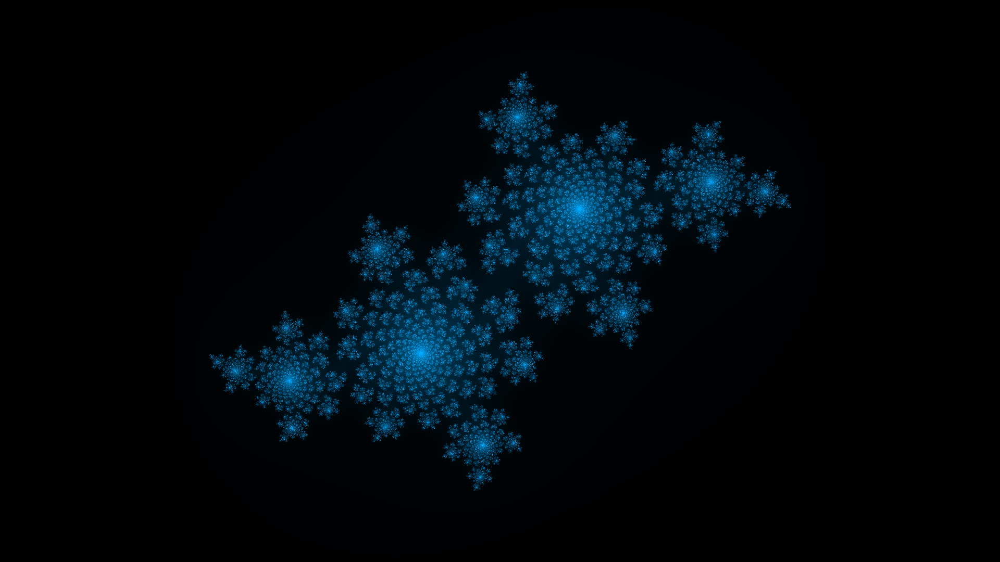
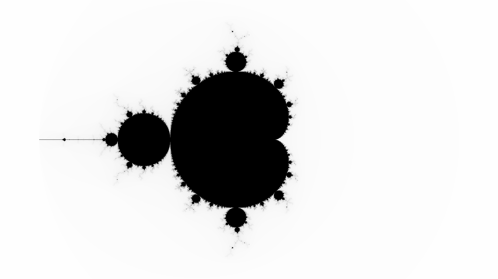

# CudaFractal

Generates fractal images using Nvidia's CUDA framework.



## Background

### Fractals

Shapes can have what is known as Fractal Symmetry (or Zoom Symmetry). That is, the shape will be retained when zoomed in to any level. Discovered by Benoit Mandelbrot in the late 70's, this symmetry appears all around in nature, from trees and blood vessels to clouds, mountains, even the galaxy and the universe.

There are many ways to generate fractal patterns. Loren Carpenter of Pixar for example, was one of the first to use fractal landscape generation to create the virtual mountainsides in many animation movies (like paradise falls in Up). This fractal generation algorithm computes the Julia set (or Mandelbrot set) of a function and maps the results as a color map on the image, creating fractal patterns that represent the interesting behaviour of complex numbers.

### Complex Numbers

The square root of -1 is defined as `i`. This number doesn't exist naturally, but it is used often for it's unique properties. When multiplied by a real constant, say `b`, the result is an imaginary number `bi`, the square of which will be negative the square of the constant, or `-b^2`, since `i^2 = -1`.

A complex number can be defined as the sum of a real number with an imaginary number `a + bi`. The sum of two complex numbers is simply the sums of the real components plus the sums of the imaginary components

	(a + bi) + (c + di) = (a + b) + (c + d)i

The product of two complex numbers is more interesting. The components must be distributed with each other, but since `i^2 = -1`, the product of the two imaginary components is a _negative_ real number, rather than positive. So the real of the product is the difference of the two real product terms.

	(a + bi)(c + di) = (ac - bd) + (ad + bc)i

Consider two complex numbers represented as shown:

	A = r*(cos(a) + sin(a)i)
	B = s*(cos(b) + sin(b)i)

The product of these two numbers reveals a consequence of imaginary multiplication:

	A*B = r*(cos(a) + sin(a)i) * s*(cos(b) + sin(b)i)
		= r*s*((cos(a)cos(b) - sin(a)sin(b)) + (cos(a)sin(b) + sin(a)cos(b))i)

		= r*s*(cos(a + b) + sin(a + b)i)

Complex numbers can be represented as vectors on an xy grid, where the x component of the vector represents the real component, and the y component of the vector represents the imaginary component. The product of two complex numbers, then, can be represented by the vector whose magnitude is the product of the magnitudes of the two complex vectors and whose angle is the sum of the angles of the two complex vectors. Naturally, then, the square of a complex number will be a complex vector with a magnitude equal to the square of the original magnitude, and an angle equal to twice the original angle.

	A   = r*(cos(a) + sin(a)i)
	A^2 = r^2*(cos(2a) + sin(2a)i)

### The Julia Set

Consider the complex function `f(z) = z^2 + c`, where `c` is a constant. Take a complex number `z` and put it through the function, then take the result and put it back into the function, doing this repeatedly infinatum. This iterative process can be written as `z[a+1] = z[a]^2 + c`. Because of the nature of complex numbers, after infinite iterations, the modulus of these numbers will either reach infinity, converge to zero, or remain bounded in an endless loop, depending on the value of `z[1]`.

Loosely speaking, the Julia Set is the map of all complex numbers that either reach infinity or remain bounded.

For example, consider a constant of `0` for now, so the iterative function becomes `z[a+1] = z[a]^2`. Start at `z[1] = 2 + 3i`. The first few iterations result in `z[2] = -5 + 12i`, followed by `z[3] = -119 - 120i`, then `z[4] = -239 + 28560i`. This set seems to go to infinity under infinite iteration. Now consider `z[1] = 0.5 + 0.75i`. The next few iterations of this number would be `z[2] = -0.31 + 0.75i`, `z[3] = -0.47 - 0.47i`, and finally `z[4] = -0.0036 + 0.43i`. This set will eventually converge to zero. The Julia Set, loosly speaking, is the map of all complex numbers that either reach infinity or remain bounded under infinite iteration. Because `c = 0`, the Julia set is a simple circle with a radius of `1`, since any number that is less than 1 decreases in value when squared, and any number greater than 1 increases in value when squared. Adding a non-zero constant `c` will complicate the set.

Julia Sets can be approximated by using a computer. Each image is a complex grid ranging from -2 to 2, and from -2i to 2i (the width bounds are extended according to the image aspect ratio). Each pixel represents an approximate complex number in the grid. The computer goes through these pixels, and performs at most 256 iterations of the function `z[a+1] = z[a]^2 + c` on the complex number, and maps the number of iterations it took for the set to reach infinity (at all) to a color (according to a set color map), creating the complex patterns.


### The Mandelbrot Set

Running the algorithm with multiple different numbers, one may determine that some values will yield juliaset with many infinite values and a monochromatic image, some will yield large blob-like patterns, and some will create intricate crystal-like structures. The Mandelbrot set developed by Benoit Mandelbrot, is a sort of roadmap of these various sets. This is generated with the same function, but, instead of assigning each pixel value to the initial value of the set, we set it to the value of the constant c and set the initial value of the set to z to 0. Running this process on each pixel will generate an image like this.



The black regions on the Mandelbrot Set are the c constants that will generate blob shapes (connected julia sets or fatou sets), while the white areas are those that will create barely visible dust-like shapes. The sweet-spot is around the edge of the mandelbrot set, as these complex values will generate complex crystal shapes.

## Usage

### Install

Requirements: Windows 10 (or later) 64-bit, Nvidia GPU

Download InstallCudaFractal.msi from the release page and run it. This will install the program into C:\Program Files\Andydevs\CudaFractal.

#### Optional: Add C:\Program Files\Andydevs\CudaFractal To Your Path

Normally, you would have to enter `> C:\Program Files\Andydevs\CudaFractal\CudaFractal` to run CudaFractal. To shorten this to `> CudaFractal`, follow these steps:

- Open `Control Panel` and navigate to `System and Security > System`
- Click `Change Settings`
- Go to the `Advanced` tab and click `Environment Variables`
- Locate `Path` in `System variables`. Click on it, and then click `Edit` below.
- Click `New`, and then add `C:\Program Files\Andydevs\CudaFractal`
- Click `Ok`

### Command Line

The format is `> CudaFractal [options]` The options are as follows

|     Option     |                                               Description                                               |   Default   |
|:--------------:|:-------------------------------------------------------------------------------------------------------:|:-----------:|
| --help         | Print help message (overrides all other options)                                                        |             |
| --cmaps        | Print list of available colormap presets (overrides all other options except help)                      |             |
| --xml arg      | Generate fractal images from an xml file (see below. overrides all other options except help and cmaps) |             |
| --mbrot        | Generate mandelbrot image (overrides cr and ci options)                                                 |             |
| --cr arg       | Set real component of complex constant to arg                                                           |    -0.4     |
| --ci arg       | Set omaginary component of complex constant to arg                                                      |     0.6     |
| --width arg    | Set width of image to arg                                                                               |    1920     |
| --height arg   | Set height of image to arg                                                                              |    1080     |
| --zoom arg     | Zoom image by arg                                                                                       |     1.0     |
| --rotate arg   | Rotate image by arg degrees                                                                             |     0.0     |
| --transx arg   | Translate image horizontally by arg                                                                     |     0.0     |
| --transy arg   | Translate image vertically by arg                                                                       |     0.0     |
| --cmap arg     | Set colormap preset being used to arg                                                                   |   nvidia    |
| --file arg     | Set filename being saved to to arg                                                                      | fractal.png |
| --mnemonic arg | Set mnemonic to arg (best used by scripts to identify what fractal is being made)                       | fractal     |
| --verbose      | Print verbose messages in program                                                                       |             |

### XML File

Fractals can be specified in an xml file, and can be read in the program using `> CudaFractal --xml [xml file name]`

The XML file format is as follows:

```
<?xml ...?>
<fractals>
	
	[fractal specs...]

<fractals/>
```

A list of fractal specs within the "fractals" tag.

Each spec has the following format:

```
<fractal mnemonic="[mnemonic of fractal (default fractal)]" mandelbrot="[true if mandelbrot set is generated (default false)]">
	<constant real="[real value (default -0.4)]" imag="[imaginary value (default 0.6)]"/> <!-- Ignored if mandelbrot is true -->
	<scale rotate="[rotation amount (default 0.0)]" zoom="[zoom amount (default 1.0)]"/>
	<translate transx="[horizontal translation (default 0.0)]" transy="[vertical translation (default 0.0)]"/>
	<image width="[image width (default 1920)]" height="[image height (default 1080)]" filename="[name of file (default fractal.png)]"/>
	
	[colormap spec...]
</fractal>
```

#### Colormaps

Colormaps can be specified in three ways. The default colormap is greyscale black to white.

##### Presets

Colormaps can be defined by preset as follows:

```
<colormap preset="[preset]"/>
```

##### Gradient

Gradient colormaps can be defined as follows:

```
<colormap type="gradient">
	<from [from color]/>
	<to [to color]/>
</colormap>
```

(see Colors section below)

##### Sinusoid

Sinusoid colormaps can be defined as follows

```
<colormap type="sinusoid" alpha="255">
	<frequency r="0.1" g="1.0" b="0.0"/>
	<phase r="1.0" g="2.0" b="0.1"/>
</colormap>
```

`alpha` defaults to `255`. `r`, `g`, `b`, values default to `0.0`

##### Colors

Colors can be defined by either using a `hex` (or `hexa` with alpha channel) value

```
<color type="hex" hex="0x00aaff" />
<color type="hexa" hexa="0x00ffaaff"/>
```

`hex` and `hexa` values default to `0x0000000`

Or by the individual `rgb` (or `rgba` with alpha channel) values

```
<color type="rgb" r="0" g="124" b="109"/>
<color type="rgba" r="0" g="20" b="200" a="255"/>
```

`r`, `g`, `b`, and `a` values default to `0`